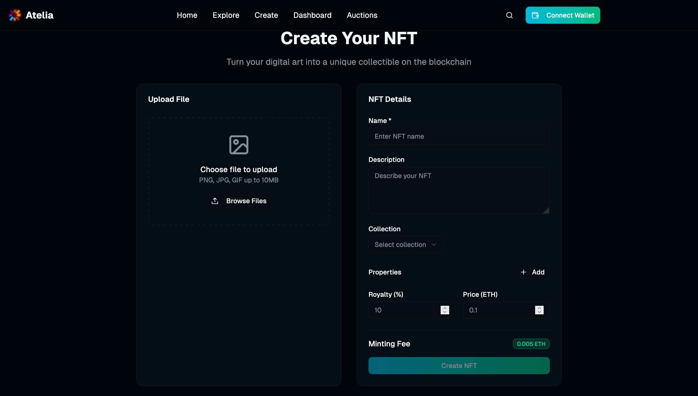

# Atelia

Atelia is a decentralized design exchange platform that empowers designers and creators from around the world to showcase, monetize, and collaborate on original works through NFTs. By leveraging blockchain technology, Atelia enables share-based investments and transparent auctions, bringing together creators, investors, and brands in a vibrant and equitable creative economy.

---

## 🚀 Overview

- **NFT Minting:** Designers mint original works as NFTs, securing provenance and global exposure.

- **Exchange & Fractional Ownership:** Designs are listed on an exchange, enabling users to invest in fractional shares.

- **Auctions for Brands:** Popular designs are promoted to auctions, where top brands can bid for exclusive ownership.

- **Community & DAO:** Governance and platform evolution are guided by the community through DAO mechanisms.
- **Security & Transparency:** All transactions are on-chain, ensuring trust and immutability.
- **Rewards & Revenue Sharing:** Revenue is distributed among creators, investors, and the platform.

---

## 🌐 Key Features

- **NFT Creation & Listing**: Seamless minting of digital designs as NFTs.
- **Fractionalized Investment**: Share-based model allows micro-investments in creative assets.
- **Auction Mechanism**: Brands and investors participate in transparent, on-chain auctions.
- **DAO Governance**: Collective decision-making on platform evolution and featured drops.
- **User-Friendly Onboarding**: Wallet support, fiat on-ramps, and educational resources.
- **API & Modular Design**: Future-proof architecture for integration with DeFi, Metaverse, and social platforms.

---

## 🏷️ Categories

- NFT
- DeFi
- DAO / Community
- Decentralized Media
- Crypto Adoption
- Token Economics Innovation

---

## 💡 Vision

Atelia strives to democratize the creative economy by making design ownership, investment, and acquisition accessible, transparent, and rewarding for all. Designers gain global reach and fair compensation; brands access exclusive innovation; and the platform grows as a thriving hub for art, technology, and commerce.

---

## 🛠️ Tech Stack

- **Smart Contracts**: Solidity/EVM for NFTs, shares, and auctions
- **Frontend**: React/Next.js with wallet integrations (MetaMask, WalletConnect, etc.)
- **Backend**: Node.js/Express for APIs and off-chain logic
- **Storage**: IPFS/Filecoin for decentralized asset storage
- **DAO**: On-chain governance and voting contracts
- **Security**: On-chain verification, audit trails, and moderation

---

## Contract Setup
I have used `andromeda solidity` contracts to create the full backend for this app. You can find the deployment script in .

## 📈 Roadmap

- Support for physical design assets (RWA)
- Creator grant programs and public good funding
- Advanced privacy features (ZK-proofs)
- Cross-chain and Metaverse integrations

---

## 👥 Team

- bytesaparna

---

## 📎 Demo Links

- [GitHub Repository](https://github.com/bytesaparna/atelia)
- [Video](https://drive.google.com/drive/folders/1TH78grEf4oFpjf1alpyHZyNejcM0eyow)
- [Demo/Deployed App](https://atelia.vercel.app/)

---

## Owner wallet address (In case one wants to check transactions)
`0xA6D02F2a4e6DBA17dc390F14e96398b4b491b249`

Atelia: Unleashing global creativity, one NFT at a time.
